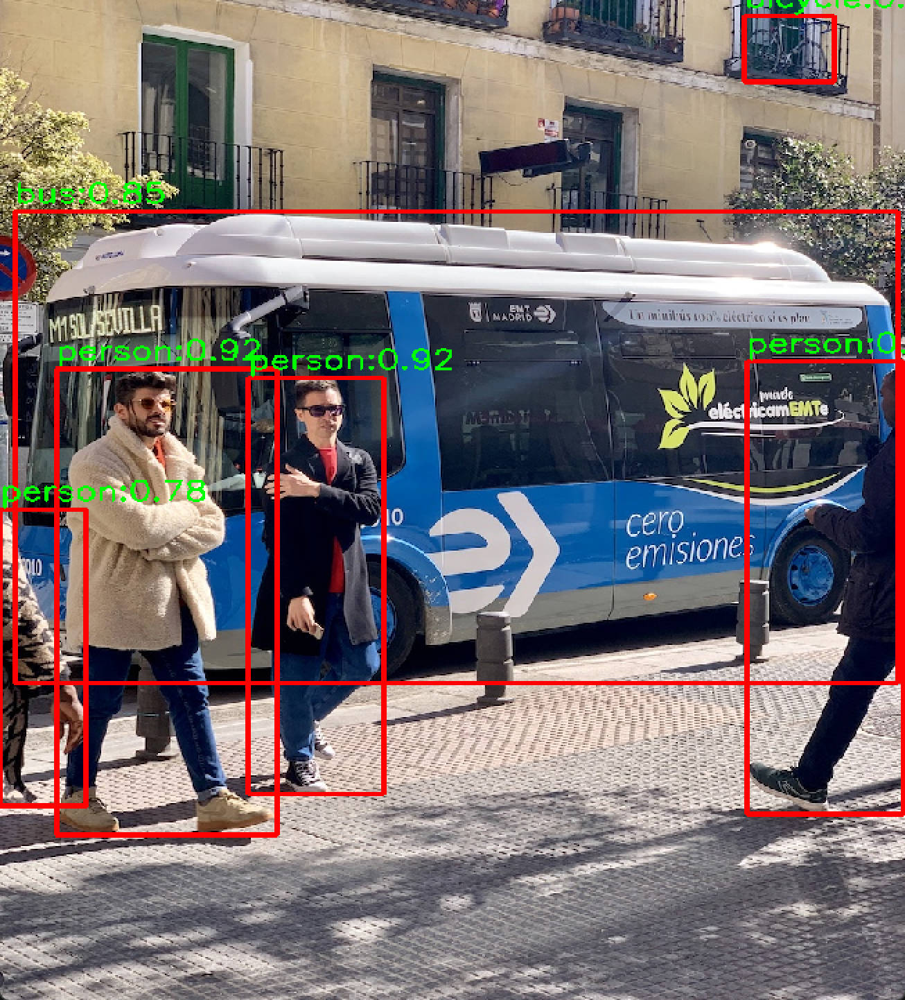
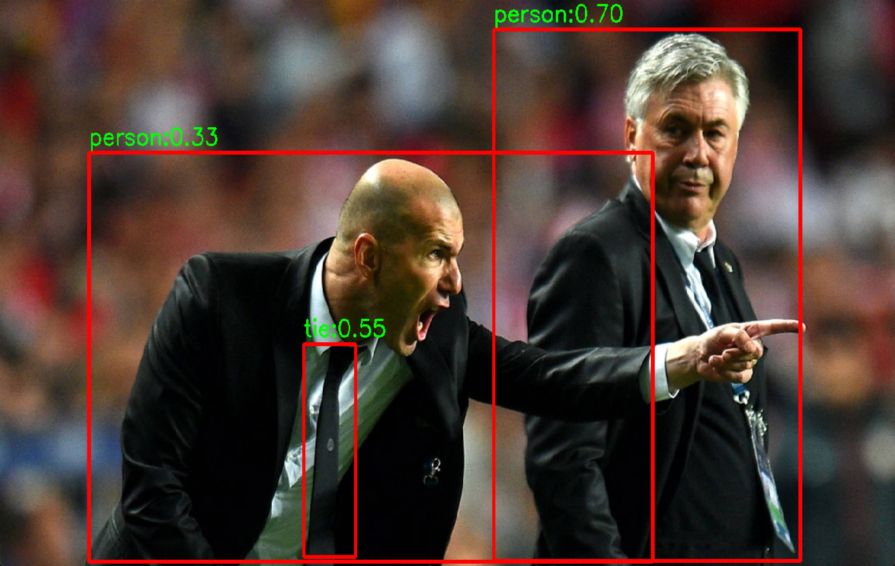

# YOLOv5-v6.1-OpenCV-ORT-OnnxRunner
  针对最新版的v6.1版本的，编写了一套兼容V6.1和之前版本的YOLOv5的部署代码，
提供了OpenCV的DNN调用以及ONNXRUNTIME两种部署框架的C++和Python代码，
支持v5模型的【n,s,m,l,x,n6,s6,m6,l6,x6】十种不同的模型  

  
<p align="center">
<em>模型运行效果图1</em>
</p> 

  
<p align="center">
<em>模型运行效果图2</em>
</p>
 
## 简介
* OpenCV：大家熟悉的OpenCV中有一个DNN的头文件是支持对ONNX模型的直接推理，可以直接调用OpenCV实现模型的调用和NMS等，但是一些模型不适配，不是所有硬件平台都可用
* ONNXRUNTIME：是最常见的方案，中间模型格式，需要额外写对ORT环境的构建，可扩展性更强
* 由于模型文件太多，我没有直接上传到仓库里，模型文件存放在 *[百度网盘](https://pan.baidu.com/s/1FWjA_vZL5HfJcUpVWACihg?pwd=7h87)* , 提取码: 7h87 
模型的训练数据集就是最基本的VOC数据集，如果需要训练针对对应的数据集进行重新的训练，
训练教程及转换格式教程见下方两个链接，可以先尝试跑通两个demo
* 官方训练代码：https://github.com/ultralytics/yolov5 
* 数据标记流程：由于不同的框架使用的数据格式是不一样的，如果标注错了要额外写代码进行转换，所以一开始最好参考一下教程，使用labelme和labelimg进行数据的标注，具体链接如下，https://blog.csdn.net/weixin_46502301/article/details/115829811
* 模型训练教程：https://blog.csdn.net/qq_36756866/article/details/109111065
* 模型转换格式教程：https://blog.csdn.net/qq128252/article/details/127105463


## 快速开始
### Requirements
* OpenCV >= 4.1.0 , 包含DNN模块
* onnxruntime-win-x64-1.14.1

### 构建与运行
```
# CMakeLists.txt文件同级目录下构建文件夹build
mkdir build
# 进入build文件夹并运行CMake来配置项目
cd build
cmake ..
# 使用下述脚本编译/链接此项目
cmake --build .
# 如果指定的编译模式为debug或release，则如下所示
# cmake --build . --config Debug
# cmkae --build . --config Release

# VS的构建方式和正常使用相同
```

